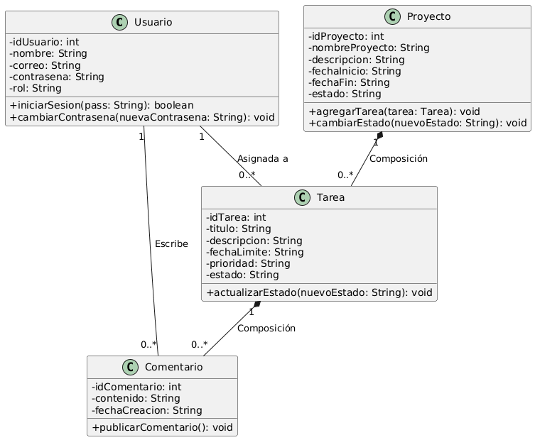

# API para Gestión de Proyectos
# Descripción general
Este Repositorio contiene el codigo fuente y la estructura base correspondiente al proyecto de **Gestion de Proyectos**, desarrollado para la asignatura Programacion Orientada a Objetos de la Carrera Ingenieria en desarrollo de Software. El sistema esta constuido con java utilizando **Maven** como gestor de construccion y dependencias.

## Integrantes del Equipo
* **CO25019** CALL ORTIZ, GABRIEL ANTONIO
* **MG25049** MURILLO GUTIERREZ, KENIA YAMILETH
* **QG24003** QUINTEROS GARCIA, MARCELA DE LOS ANGELES
* **RA23035** RAMOS ALFARO, ROBERTO RAFAEL
* **RM20102** RUZ MARTNEZ,ABNER GABRIEL

# Tecnologias Utilizadas
* **Lenguaje:** Java21
* **Gestor de Construcion:** Maven
* **Control de Versiones** Git & GitHub

### Diagrama de Clases UML

